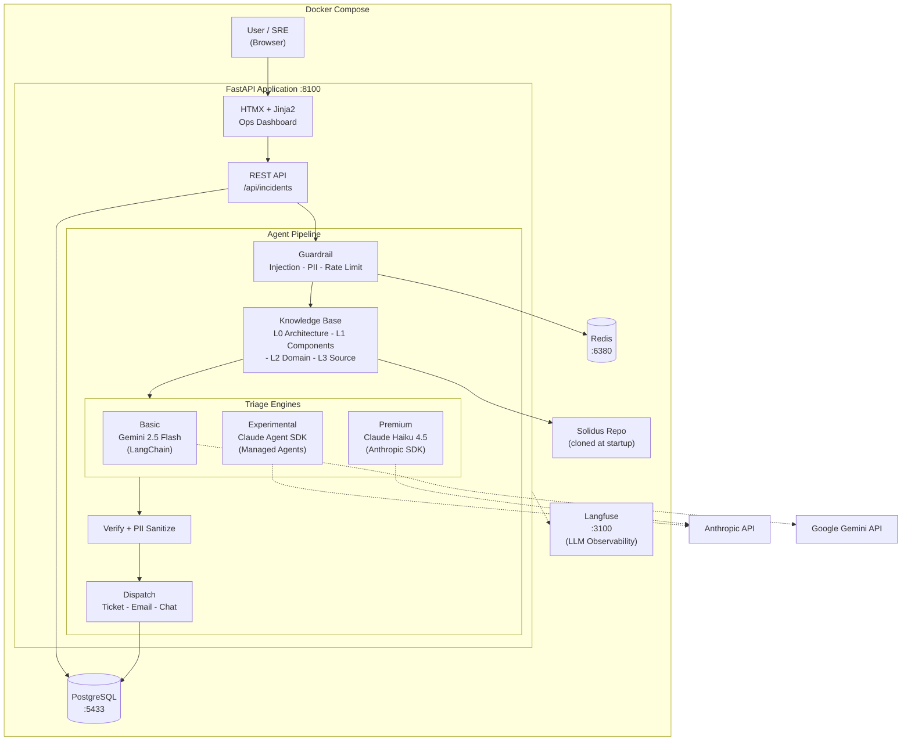
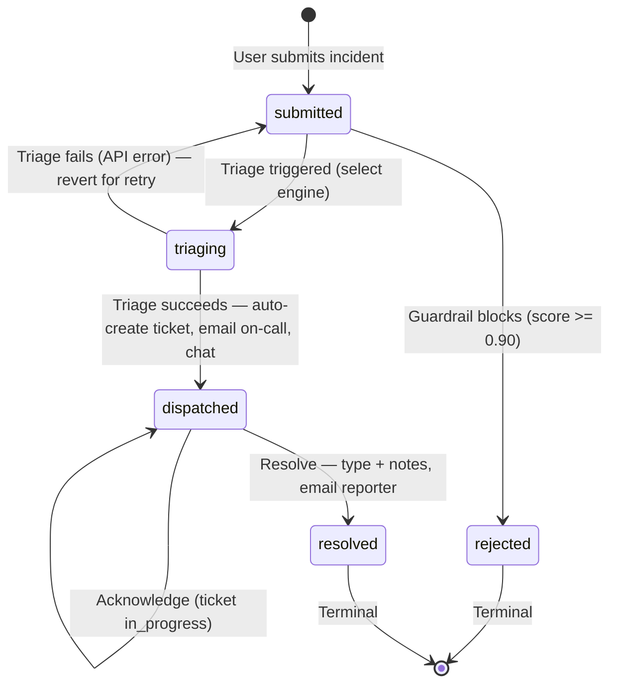

# Triagista

AI-powered SRE Incident Intake & Triage Agent for the [AgentX Hackathon 2026](https://github.com/anthropics/agentx-hackathon).

**The problem:** When an SRE incident is reported, engineers spend 15-30 minutes manually triaging — reading descriptions, searching codebases, classifying severity, and routing to the right team. This is slow, error-prone, and pulls senior engineers away from fixing.

**Our solution:** An AI agent that takes an incident description, analyzes it against the [Solidus](https://github.com/solidusio/solidus) e-commerce codebase (~30K LOC), and produces a structured triage in ~15 seconds: severity classification (P1-P4), root cause hypothesis, affected source files, recommended actions, and auto-dispatches a ticket with team notifications.

**Three triage engines** — choose per incident:

| Engine | Model | Cost | Speed | Best for |
|--------|-------|------|-------|----------|
| **Basic** | Gemini 2.5 Flash (via LangChain) | Lowest cost | ~8s | Budget-friendly, generous free tier |
| **Premium** | Claude Haiku 4.5 (Anthropic SDK) | ~$0.005 | ~8s | Highest accuracy |
| **Experimental** | Claude Agent SDK (Managed Agents) | ~$0.02-0.05 | ~3-5 min | Autonomous codebase exploration |

All engines produce the same structured output. The Experimental engine is the most powerful — it provisions a cloud container, clones the repo, and explores files autonomously.

## Prerequisites

- [Docker](https://docs.docker.com/get-docker/) (v24+) and [Docker Compose](https://docs.docker.com/compose/install/) v2+
- At least one AI API key (see "Engine Setup" below)
- ~4 GB disk (Docker images + Solidus repo clone)

No Python, Node.js, or database install needed — everything runs in Docker.

## Quick Start

```bash
# 1. Clone the repo
git clone https://github.com/brownbull/sre-triage-agent.git
cd sre-triage-agent

# 2. Copy environment file
cp .env.example .env

# 3. Add at least one API key (see "Engine Setup" below)
#    Minimum: ANTHROPIC_API_KEY for Premium engine
#    Edit .env and set: ANTHROPIC_API_KEY=sk-ant-...

# 4. Start everything (first build takes ~2 min)
docker compose up --build -d

# 5. Wait for all services to be healthy (~30s after build)
docker compose ps   # all should show "Up" / "healthy"

# 6. Open the app
open http://localhost:8100
```

On first startup the app automatically:
- Clones the Solidus e-commerce codebase (~30K LOC)
- Creates database tables
- Seeds **18 sample incidents** covering all lifecycle states, engines, and attachment types
- Creates a Langfuse account, project, and API keys
- Seeds Langfuse with pipeline traces, sessions, and user data

The app seeds itself with **18 sample incidents** on first startup covering all lifecycle states, all 3 triage engines, and multiple attachment types.

## Engine Setup

### Basic (Free — no credit card needed)

Get a free Google Gemini key at https://aistudio.google.com/apikey and set:

```env
GOOGLE_API_KEY=AIza...
```

Optional fallback — get a free Groq key at https://console.groq.com:

```env
GROQ_API_KEY=gsk_...
```

### Premium (Anthropic SDK)

Get an API key at https://console.anthropic.com/ and set:

```env
ANTHROPIC_API_KEY=sk-ant-...
```

### Experimental (Managed Agents)

Requires Anthropic Managed Agents beta access. Create an agent and environment in the Claude Console, then set:

```env
MANAGED_AGENT_ID=agent_...
MANAGED_ENVIRONMENT_ID=env_...
```

See `docs/managed-agent-setup.md` for the agent YAML configuration. Without these IDs, the Experimental engine falls back to a keyword-based stub.

### Which engines are available?

The submit form and detail page auto-detect which engines are configured and disable unavailable options. At minimum, set `ANTHROPIC_API_KEY` for the Premium engine.

## Access Credentials

| Service | URL | Credentials |
|---------|-----|-------------|
| **App** | http://localhost:8100 | No auth required |
| **Langfuse** (LLM Observability) | http://localhost:3100 | `admin@sre-triage.local` / `admin123` |
| **API Docs** | http://localhost:8100/docs | Swagger UI |
| **Health Check** | http://localhost:8100/health | — |
| **Observability Status** | http://localhost:8100/api/observability | — |

> Langfuse account, project, and API keys are **auto-created** on first startup. No manual setup needed.

## Demo Flow (3 minutes)

1. **View seeded incidents** at `/incidents` — 18 pre-loaded incidents with sorting, filtering, and pagination
2. **Browse the list** — filter by Status, Severity, or Engine; sort by any column; see attachment icons
3. **Click a triaged incident** — see full triage results with pipeline progress, KPIs, engine info strip, explanation layers
4. **Click pipeline dots** — info panel shows what happened at each stage
5. **Submit a new incident** via `/incidents/new` — select a triage engine, submit, watch the progress overlay
6. **See results** — severity, root cause, affected Solidus files, recommended actions, dispatch cards
7. **Check the Chat view** — click the Chat tab to see the conversation timeline
8. **Resolve the incident** — Acknowledge, then Resolve with type and notes
9. **Test guardrails** — submit a prompt injection, see it blocked with guardrail rejection details
10. **View Langfuse** — open http://localhost:3100, check Traces, Sessions, and Users tabs
11. **Toggle settings** — switch dark/light theme, font size, font family; collapse sidebar

## Architecture



## Incident Lifecycle



## Key Features

- **Ops Dashboard** — modern dark/light UI with sidebar, pipeline progress, KPIs, explanation layers
- **3 Triage Engines** — Basic (Gemini), Premium (Claude), Experimental (Managed Agents)
- **Triage Progress Overlay** — animated pipeline steps while AI analyzes
- **Auto-Triage on Submit** — form submission chains directly into triage with selected engine
- **Pipeline Info Panel** — click dots to see stage details (guardrail score, triage engine, dispatch info)
- **Triage Engine Strip** — shows model, framework, and token usage per incident
- **Attachments** — upload log files + screenshots; inline viewer with image preview and log rendering
- **Attachment Indicators** — list view shows log/image icons per incident
- **Sortable/Filterable List** — sort by any column, filter by status/severity/engine, paginated (20/page)
- **Chat Timeline** — conversation-style view of triage messages with coming-soon interactive input
- **Explanation Layers** — General / Specialist / Non-technical views of the diagnosis
- **Guardrail Rejection Panel** — blocked submissions show injection flags and threat analysis
- **Collapsible Sidebar** — toggle between full and icon-only sidebar
- **Settings** — theme (dark/light), font size (S/M/L), font family (8 options)
- **Langfuse Integration** — traces, sessions, users tabs populated; errors and rejections traced
- **18 Seed Incidents** — all lifecycle states, all 3 engines, varied attachments

## Stack

- **Backend**: Python 3.12, FastAPI, SQLAlchemy (async), PostgreSQL
- **Frontend**: HTMX, Jinja2, CSS (Ops dashboard with dark/light themes)
- **AI**: Anthropic Claude Haiku 4.5, Google Gemini 2.5 Flash, Groq Llama 3.3, Claude Agent SDK
- **Knowledge**: Progressive disclosure (L0-L3) codebase knowledge base
- **Observability**: OpenTelemetry, Langfuse (traces, sessions, users)
- **Infrastructure**: Docker Compose, Redis

## Port Map

| Service | Port |
|---------|------|
| App | 8100 |
| PostgreSQL | 5433 |
| Redis | 6380 |
| Langfuse | 3100 |

## Testing

```bash
# Unit + integration tests (82 tests, inside Docker)
docker compose exec app pytest tests/ -v

# E2E tests with screenshots (21 tests, from host, requires Playwright)
npx playwright test

# Lint
docker compose exec app ruff check app/ tests/
```

## Project Structure

```
app/
+-- config.py                 # Settings (env vars)
+-- main.py                   # FastAPI app + lifespan
+-- database.py               # Async SQLAlchemy
+-- models/                   # ORM models (incident, ticket, notification)
+-- schemas/                  # Pydantic DTOs
+-- routes/                   # API + HTML page routes
+-- pipeline/
|   +-- guardrail/            # Injection detection, PII scan, rate limiting
|   +-- knowledge/            # Progressive disclosure L0-L3 codebase knowledge
|   +-- triage/               # 3-engine triage (Anthropic, LangChain, Managed)
|   +-- explain.py            # Explanation layers (general/specialist/non-tech)
|   \-- dispatch/             # Ticket + notification creation
\-- services/
    +-- codebase_indexer.py   # Solidus repo keyword index
    +-- observability.py      # OpenTelemetry + Langfuse setup
    +-- seed_data.py          # 18 sample incidents for dev
    +-- seed_attachments/     # Mock log files + screenshots
    \-- seed_langfuse.py      # Auto-create Langfuse account/keys
```

## Troubleshooting

| Problem | Fix |
|---------|-----|
| `clone-solidus` fails | Check internet connection; the Solidus repo is cloned from GitHub on first startup |
| Port conflict on 8100/5433/6380/3100 | Another service is using the port. Stop it or edit `docker-compose.yml` ports |
| Triage returns "AI provider temporarily unavailable" | Check your API key in `.env` — the engine needs a valid key |
| Langfuse shows empty traces/sessions | Restart app: `docker compose restart app` — seed runs on startup |
| Database errors after code changes | Reset volumes: `docker compose down -v && docker compose up --build -d` |

## License

[MIT](LICENSE)
