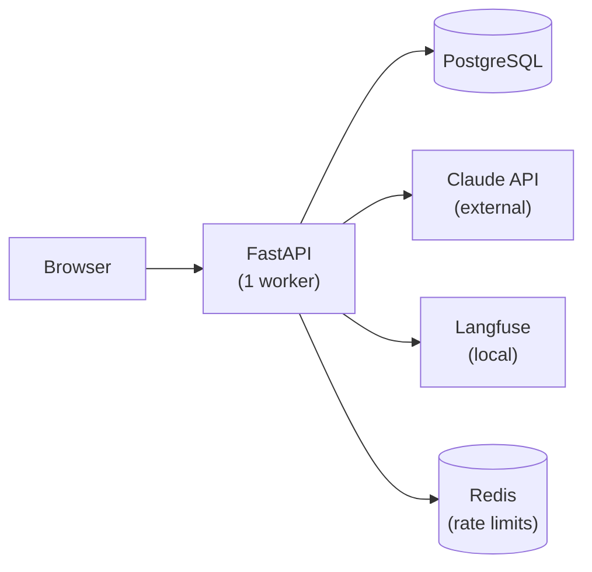
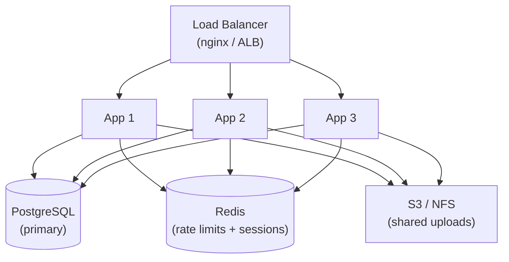
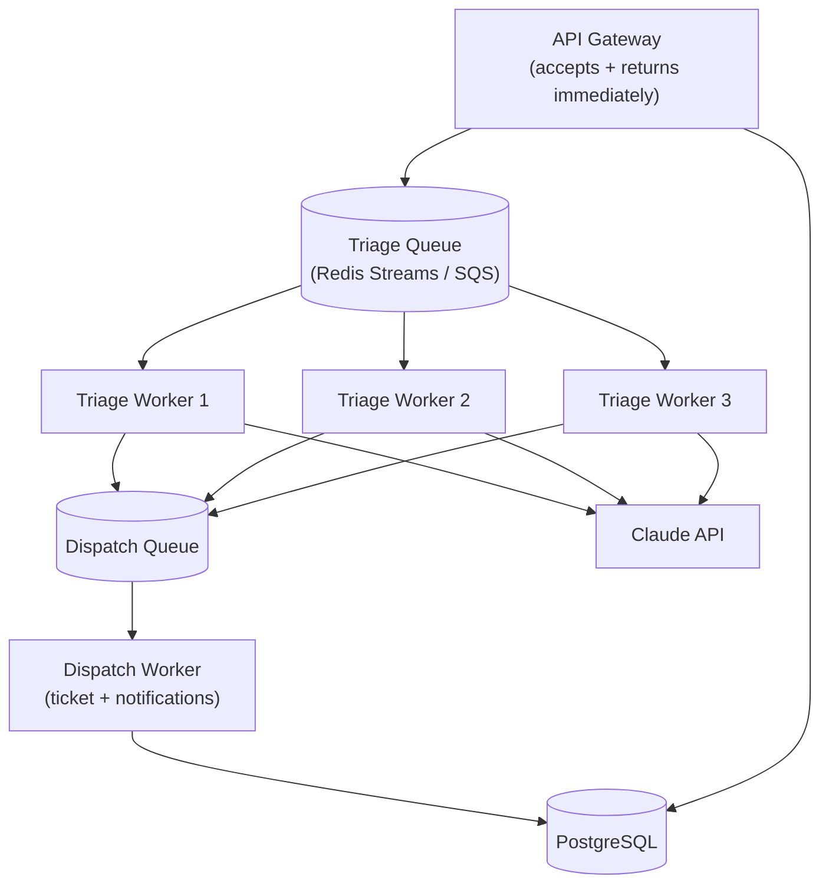

# SCALING.md

## Current Architecture

The SRE Triage Agent runs as a single Docker Compose stack:



### Current Capacity

| Metric | Current | Bottleneck |
|--------|---------|-----------|
| Concurrent triages | ~10 | Claude API latency (10-20s per call) |
| Incidents/hour | ~100 | Rate limited to 10/reporter, DB writes are fast |
| Codebase index size | ~30K LOC | In-memory, rebuilt at startup (<5s) |
| File uploads | 5MB per file | Stored on local volume |

---

## Scaling Strategy

### Tier 1: Vertical Scaling (10x)

**Effort: Low | Impact: 10-50 concurrent users**

- Increase uvicorn workers (`--workers 4`) to use all CPU cores
- Move rate limiter from in-memory dict to Redis (already in the stack)
- Add connection pooling to PostgreSQL (SQLAlchemy pool already configured)
- Increase Claude API rate limit tier with Anthropic

```yaml
# docker-compose.yml change
command: ["uvicorn", "app.main:app", "--host", "0.0.0.0", "--workers", "4"]
```

### Tier 2: Horizontal Scaling (100x)

**Effort: Medium | Impact: 100-500 concurrent users**



Changes required:
- **Load balancer** in front of multiple app containers
- **Redis** for rate limiting and session state (replace in-memory dict)
- **Shared file storage** for uploads (S3 or NFS instead of local volume)
- **Codebase index** pre-built and stored in Redis or shared volume (avoid rebuild per worker)
- **Database connection pooling** via PgBouncer

### Tier 3: Queue-Based Architecture (1000x)

**Effort: High | Impact: 1000+ incidents/hour**



Changes required:
- **Async triage**: API accepts incident and returns immediately, triage runs in background worker
- **Message queue**: Redis Streams or SQS for triage and dispatch queues
- **Worker pool**: Separate containers for triage workers (scale independently based on Claude API capacity)
- **Status polling**: HTMX auto-refresh already works (polls every 3s during triaging state)
- **Database**: Read replicas for incident list queries, primary for writes

---

## Key Bottlenecks

### 1. Claude API Latency (Primary)

The triage call to Claude takes 10-20 seconds. This is the dominant bottleneck.

**Mitigations:**
- Queue-based architecture decouples user response from triage completion
- HTMX auto-refresh already handles async display (page polls during "triaging" state)
- Haiku model is 3x faster than Sonnet with comparable quality for this use case
- Pre-computed codebase context reduces prompt size

### 2. Codebase Index Rebuild

Index is rebuilt at startup (~3-5s for Solidus 30K LOC). For larger codebases:

**Mitigations:**
- Cache index in Redis or on a shared volume
- Incremental index updates via git diff (only re-index changed files)
- Pre-build index in CI/CD and mount as read-only volume

### 3. Rate Limiting

Currently in-memory (per-process). Doesn't work with multiple workers.

**Mitigation:** Move to Redis with `INCR` + `EXPIRE` (sliding window) — already have Redis in the stack.

### 4. File Storage

Uploads stored on local Docker volume. Not shared across containers.

**Mitigation:** S3-compatible object storage (MinIO for self-hosted, AWS S3 for cloud).

---

## Production Deployment Considerations

| Concern | Solution |
|---------|----------|
| **HTTPS** | Reverse proxy (Caddy/nginx) with Let's Encrypt |
| **Auth** | OAuth2 / SSO integration (not needed for hackathon) |
| **Backups** | PostgreSQL pg_dump on cron, S3 for uploads |
| **Monitoring** | Langfuse for LLM, Prometheus + Grafana for infra |
| **Secrets** | Vault or AWS Secrets Manager (not .env files) |
| **CI/CD** | GitHub Actions → build → test → deploy to ECS/K8s |
| **Multi-tenancy** | Organization model, scoped incidents per team |

---

## Multi-Ticket Handling

The current system processes incidents individually. At scale, intelligent multi-ticket handling becomes a differentiator:

### Deduplication
- Before triage, compare new incident against open incidents using text similarity
- If similarity > 80%, flag as potential duplicate and link to existing incident
- Implementation: vector embeddings stored in pgvector, cosine similarity search

### Batch Triage
- During outages, multiple incidents arrive simultaneously about the same root cause
- Group related incidents by category/component, triage the first one, apply results to the group
- Reduces LLM calls from N to 1 for correlated incidents

### Priority Queue
- P1 incidents skip the queue and triage immediately
- P3/P4 incidents can be batched and triaged in bulk during off-peak hours
- Implementation: Redis Sorted Sets with severity-based scoring

---

## Cost Estimates

| Component | Cost (at 1000 incidents/day) |
|-----------|------------------------------|
| Claude Haiku API | ~$5/day (~5K tokens/triage × 1000 triages × $0.001/1K tokens) |
| PostgreSQL (RDS) | ~$50/month (db.t3.medium) |
| App hosting (ECS) | ~$30/month (2 tasks, 0.5 vCPU each) |
| Langfuse | Self-hosted ($0) or cloud ($59/month) |
| **Total** | ~$230/month for 1000 incidents/day |
